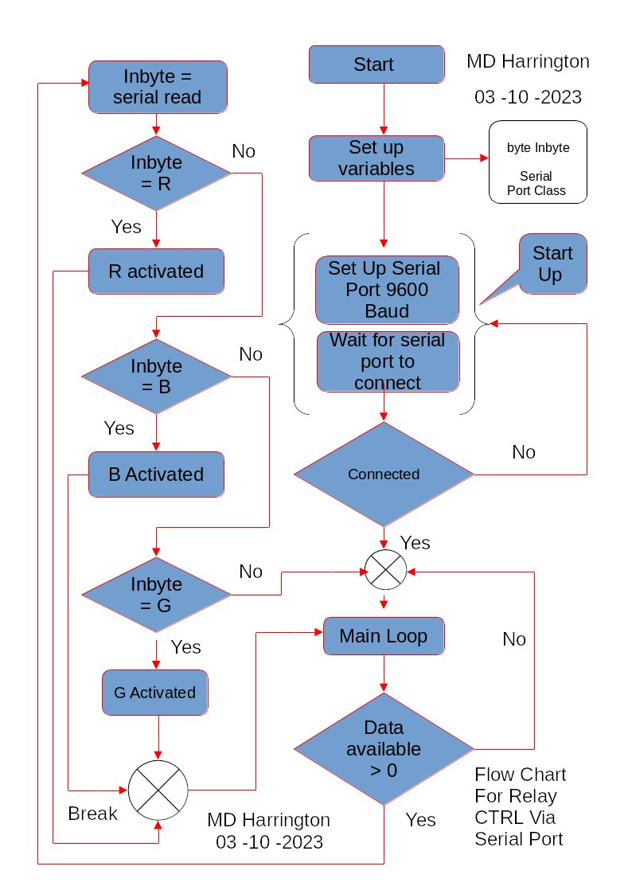
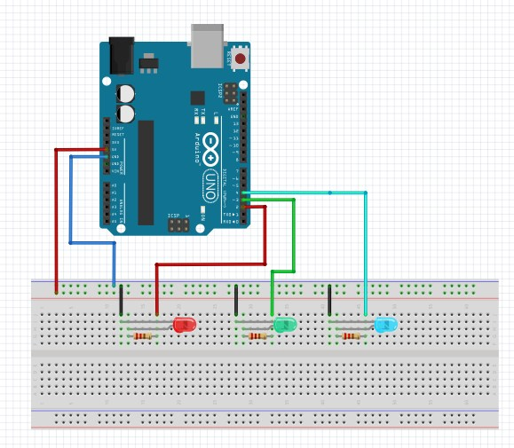

# GanbasSerialController

Gambas (Basic  for Linux) application for controlling  relays , leds lighting  
With modifications  to code  can be used  to create many projects  Ideal for people wanting to learn  
The files for code etc  are hidden files in the repo

A fully interactive serial port controller that both recieves and returns current status of output  ports using  arduino  as peripheral  communications device

The  project can  be modified  both within arduino  code and also Gambas application code to do far more than  just this
but is the prefect  way to start a  project that will advance you into high level langauges  do something  highly usefull  for industrial or domestic applications

?raw=true "Gambas Arduino Serial Port controller"

Code  for the main form class is as below for those whishing to see this although you can see all simply by changing settings on your folder  view

```text
' Gambas class file

Private m_baud As Integer
Private m_databits As Integer
Private m_parity As Integer
Private m_flowControl As Integer
Private m_FlagConnected As Boolean
Private m_retval As Integer
Private Rx As String 
Private Tx As String 
Private retReply As String
Private m_imagePath As String 
Private m_imagePath2 As String
Private m_buttonstate[3] As Integer


Public Function showPortSpecs()

        With SerialPort1
              
               Print "Hardware  set to " & .FlowControl
               Print "Parity set to  " & .Parity
               Print "Stop bits set to " & .StopBits
               Print "Baudrate set to " & .Speed 
               Print "Databits set t0 " & .databits 
               Print "Port Name is " & .PortName 
               
        End With

End 
Public Sub CmbFlowControl_Click()

 Dim sFlow As String 
 
      sFlow = CmbFlowControl.Text
       
       If SerialPort1.Status = Net.Inactive Then 
               
               Select Case sFlow
                 
                  Case "None"
                    
                          SerialPort1.FlowControl = SerialPort.None
                  Case "Hardware"
                     Print "Hardware selected " & SerialPort.Hardware 
                          SerialPort1.FlowControl = SerialPort.Hardware 
                  
                  Case "Software"
                        
                             SerialPort1.FlowControl = SerialPort.Software
                             
                  Case "Hardware & Software"
                  
                              SerialPort1.FlowControl = SerialPort.Both 
                  Case Else 
                    
                    Print "Not a choice "
                    
              End Select
         
       
          Else 
        
               Message.Warning("Serial port settings" & "\n" & "Can only be changed when port is closed")
    
      Endif
        
End

Public Sub Form_Open()

      m_FlagConnected = False '  arduino is not connected 
      m_retval = 0 
      'Set the  file paths up for  images
      m_imagePath = "ledOn.jpeg"
      m_imagePath2 = "ledOff.jpeg"
      m_buttonstate = New Integer[3]
      
      lbPortStatus.Text = "Port Closed"
      lbPortStatus.Foreground = Color.Blue 
      
      
             ' set  baudrate etc in combo box to default  values 
              cmbBaudRate.Index = 2
              CmbFlowControl.Index = 0
              
      ' set default initialisation  values  for button state  array 
      For i As Integer = 0 To 2
          m_buttonstate[i] = 0 
              Next


End


Public Sub Form_Close()

    If SerialPort1.Status == Net.Active Then 
       SerialPort1.Close 
        Message.Info("Closing serial port ")
        lbPortStatus.Text = "Port Closed"
        lbPortStatus.Foreground = Color.Blue 
        Else 
          Message.Info("Serial Port is closed")
      
    Endif
 
 End 
 
 
 

  Public Sub BtnStartPortFind_Click()
    Dim sString, my_Env As String
 
  
   ' get the current application  path 
   my_Env = Application.Path
   'show this path 
    Print my_Env

   m_retval = Message.Warning("Please ensure Arduino Uno  is connected" & "\n" & "Then  confirm  with Connected Button ", "Connected ", "Cancel") 

   
        If m_retval == 1 Then 
          
            ' run python script to detect which ports 
            
               Shell (my_env & "/" & "./PortsList.py") To sString
                  'Print sString  debug  only 
                      txtPortName.Text = sString
                      Print "Port name is set to " & SerialPort1.PortName
        
          Else 
             
              m_retval = Message.Error("Is arduino  connected  ? " & "\n" & "Did you confirm connected ? ", "Yes", "No") 
                    
                    If m_retval == 1 Then 
                       Message.Info("You must have arduino connected" & "\n" & " Please try and reconect ")
                       
                    Endif
         ' reset  m_retval 
         
            m_retval = 0 
        
        Endif
   
        If txtPortName.Text == "" Then 
           Message.Info("Arduino is either disconnected" & "\n" & "Or" & "\n" & "You have not made yourself members of " & "\n" & "correct groups " & "\n" & "Please try and reconect and try  again ")
         
        Endif


End


Public Sub RadNone_Click()


  If SerialPort1.Status = Net.Inactive Then 
  
            If RadNone.Value == True Then 
        ' setting parity 
              m_parity = SerialPort.None
                
             'setting  the forms serial port  parity 
                   SerialPort1.Parity = m_parity 
             Endif
           
       Else 
        
            Message.Warning("Serial port settings" & "\n" & "Can only be changed when port is closed")
            
  Endif

End

Public Sub RadEven_Click()

  If SerialPort1.Status = Net.Inactive Then 
  
        If RadEven.Value == True Then 
            m_parity = SerialPort.Even
             
                 'set the forms serial port  parity 
                    SerialPort1.Parity = m_parity 
        Endif


    Else 
        
               Message.Warning("Serial port settings" & "\n" & "Can only be changed when port is closed")
  Endif

End

Public Sub RadOdd_Click()
  If SerialPort1.Status = Net.Inactive Then 
    
        If RadOdd.Value == True Then 
           m_parity = SerialPort.Odd
             
                'set the forms serial port  parity 
                  SerialPort1.Parity = m_parity 
        Endif 
      
     Else 
        
               Message.Warning("Serial port settings" & "\n" & "Can only be changed when port is closed")
    
  Endif

End

Public Sub Rad8Databits_Click()

   If SerialPort1.Status = Net.Inactive Then 
      
            If Rad8Databits.Value == True Then 
                m_databits = SerialPort.Bits8
                      Print "Databits set to" & m_databits 
                        'setting  the forms serial port  databits 
                            SerialPort1.DataBits = m_databits 
            
            Endif
       
      Else 
        
               Message.Warning("Serial port settings" & "\n" & "Can only be changed when port is closed")
    
  Endif

End


Public Sub Rad7DataBits_Click()
   
    If SerialPort1.Status = Net.Inactive Then 
     
            If Rad7DataBits.Value == True Then 
               m_databits = SerialPort.Bits7
                   Print "Databits set to" & m_databits 
                     'setting  the forms serial port  databits 
                       SerialPort1.DataBits = m_databits 
                   
            Endif
     
        Else 
        
               Message.Warning("Serial port settings" & "\n" & "Can only be changed when port is closed")
    
     Endif

End

Public Sub SerialPort1_Read()

  'this line below  attempts to read data from the serial port represented by "SerialPort1" 
    'and stores it in the variable "Rx."
      ' Lof(Sport) is used to read the length of data available in the serial port buffer.
          Try Read #SerialPort1, Rx, Lof(SerialPort1) 

        ' This condition checks if an error occurred during the read operation.
          If Error Then 
           ' If there is an error, the code jumps to the label "NoRx."
             Print "Rx Error encountered "
             Goto NoRx
         
         Endif
          
           TextArea1.Text = TextArea1.Text & Rx   ' Append the received data   
           retReply = TextArea1.Text
           
   
   NoRx: ' This is the label that where code execution will jump to should there be error 
      
      Rx = "" ' Reset the Rx  variable to  null data .Text & Rx  ' Append the received data

End

Public Function sendData(strval As String)
  
   If SerialPort1.Status = Net.Active Then 
      
      'get the text from the  textField  and assign to TX string variable 
     
      
          'Start writing to the transmitt  buffer 
          SerialPort1.Begin()
          'Write the string to the serial out buffer 
          Write #SerialPort1, strval
          ' send this entore string  from the serial port buffer in one go 
          SerialPort1.Send() 
         
    Else 
          Message.Info("ttyUSB0 is not open \n Please open the port  ")
  Endif 
  
  
End

Public Function changeButtonImageState(index As Integer)
    
      Select index
         Case 0 
           
            If m_buttonstate[index] == 0 Then
                  PictureBox2.Picture = Picture.Load(m_imagePath)
                    m_buttonstate[index] = 1 
                Else 
                     PictureBox2.Picture = Picture.Load(m_imagePath2)
                      m_buttonstate[index] = 0
              Endif
              
         Case 1 
           
            If m_buttonstate[index] == 0 Then
                  PictureBox3.Picture = Picture.Load(m_imagePath)
                    m_buttonstate[index] = 1 
                Else 
                     PictureBox3.Picture = Picture.Load(m_imagePath2)
                      m_buttonstate[index] = 0
              Endif
         Case 2
           
             If m_buttonstate[index] == 0 Then
                  PictureBox4.Picture = Picture.Load(m_imagePath)
                    m_buttonstate[index] = 1 
                Else 
                     PictureBox4.Picture = Picture.Load(m_imagePath2)
                      m_buttonstate[index] = 0
              Endif
        
        
      End Select
    
    
            

End 

Public Sub BtnRelay1_Click()
      ' Reset  for next message
    If SerialPort1.Status = Net.Active Then 
      
       TextArea1.Text = "" 
     
        Tx = "R" 
      
          sendData(Tx)   
        
              changeButtonImageState(0)
    Else 
    
            Message.Info("Serial port is not open \n Please open the port  ") 
    Endif  
End

Public Sub BtnRelay2_Click()

  If SerialPort1.Status = Net.Active Then 
     TextArea1.Text = "" 
     
      Tx = "B"
      
        sendData(Tx)   
               
         
           changeButtonImageState(1)
    Else 
    
            Message.Info("Serial port is not open \n Please open the port  ") 
   Endif 

End

Public Sub BtnRelay3_Click()

    If SerialPort1.Status = Net.Active Then 
      
      TextArea1.Text = "" 
           Tx = "G"

              sendData(Tx)   

                 changeButtonImageState(2)
       Else 

            Message.Info("Serial port is not open \n Please open the port  ") 
   Endif 

End

Public Sub BtnOpenPort_Click()

  ' Chack port status 
    showPortSpecs()

          Print "Serial port status is " & SerialPort1.Status
          
           If SerialPort1.Status == Net.Inactive Then 
           
                ' attempt to open port  You can pass an interger value to the Open() method for number of retries 
                 Try SerialPort1.Open()
                     ' If there is an error then display message to user 
                    If Error Then
                    Message.Error("Error when opening the /dev/ttyUSB0" & "\n" & "Status = " & SerialPort1.Status)
                    Endif 
                    
                    'load the image to display on
                PictureBox1.Picture = Picture.Load("ledOn.jpeg")
                lbPortStatus.text = "Connected "
                lbPortStatus.Foreground = Color.Red
          Else 
            
             'if the user tries to re open port  after open then tell user that the port is  open 
             Message.Info("ttyUSB0 is already open ")
             
          Endif

End

Public Sub BtnClosePort_Click()
      
       If SerialPort1.Status == Net.Active Then 
            SerialPort1.Close 
            Message.Info("Closing serial port ")
            TextArea1.Text = "" 
            PictureBox1.Picture = Picture.Load("ledOff.jpeg")
            lbPortStatus.Text = "Port Closed"
            lbPortStatus.Foreground = Color.blue
        Else 
              Message.Info("Serial Port is closed")
   
      Endif
  

End


```

## Code for Arduino Md Harrington  Bexleyheath  Kent London UK

IDE Version: 2.2.1
Date: 2023-08-31T14:16:33.536Z
CLI Version: 0.34.0
Copyright © 2023 Arduino SA

```text
/*
 MD Harrington  serial communications to control relays , other devices etc 
 
 10/10/2023


*/

char inbyte ;

String checkvalue , portval ;


void switchPins(byte value)
{
 // toggle the last state 
 PORTD = PORTD ^ value;
}

String checkPortValue(int value)
{

  //  create a variable to hold pin status 
    unsigned int portValue ;
    
    portValue = (PIND & (value)) ;
    portval = String(portValue) ;
    return portval  ;


}

void setup() {

      DDRD = 0b00011100 ;  // sets pin d2 ,d3 ,d4 as outout
      
      //Initialize serial and wait for port to open:
     
      Serial.begin(9600);
     
      while (!Serial) {
        ;  // wait for serial port to connect. Needed for native USB port only
      }

  // prints title with ending line break
  Serial.println("Arduino Uno ready to receive data");
}

    void loop() {
    
    // check if we have any serialdata present incomming 
    //  If so then the length be greater than 0 
    if(Serial.available()> 0)
    {
      // read the entire  contents to  null terminating characgter
      inbyte = Serial.read() ;


            switch (inbyte)
            {
              case 'R':
              Serial.println("Red Led ,Relay Switch actioned") ;
              switchPins(0x04) ;
             
              checkvalue = checkPortValue(0x04) ;
             


              Serial.println("The value of register is " + checkvalue ) ;
              break ;

              case 'B':
              Serial.println("Blue Led actioned") ;
              switchPins(0x08) ;

              checkvalue = checkPortValue(0x08) ;
              Serial.println("The value of register is " + checkvalue ) ;
              break ;

              case 'G':
              Serial.println("Green Led actioned") ;
              switchPins(0x10) ; // set pin 
              checkvalue = checkPortValue(0x10) ;
              Serial.println("The value of register is " + checkvalue ) ;
              break ;

            }

    }
  
}
```

## Diagram for Arduino  connections 

 


You will also  need to enable  gb.net  so as to  gain access to the serial control  module and its functions 

This is how you do this 

## Using Gambas IDE  

Do the following 

1: Project properties  --> Select Components --> You  will see  a list of extra components that you can gain access to  --> Scoll down
 till  you see the tick box gb.net --> tick this then click ok on that page  

Please see image below for better illustration


Your ready to start writing code 

Arduino  code and project also included  with diagrams in how to wire up the  Arduino to led's   but  you can  change this for opto  coupled relay boards  available on the net 

Enjoy , be creative , learn as much as you can and never be afraid to try something  different 

Remember always  
1:  Hardware always comes first  Knowing what your hardware does is  critical 
2: Flow charts   This helps with  coding 
3: Lots of  hard work and stress  Thats what makes  you tick and gets your mind  active  Keep it active 
4: Results are  when it works and then the joys  and self  appreciation  become your  input into what  you do 

5:Finally  now you can add the next set of skills to ,   I hope a never ending path to true enlightenment  and so  your doors that were once closed  open literally and laterally
